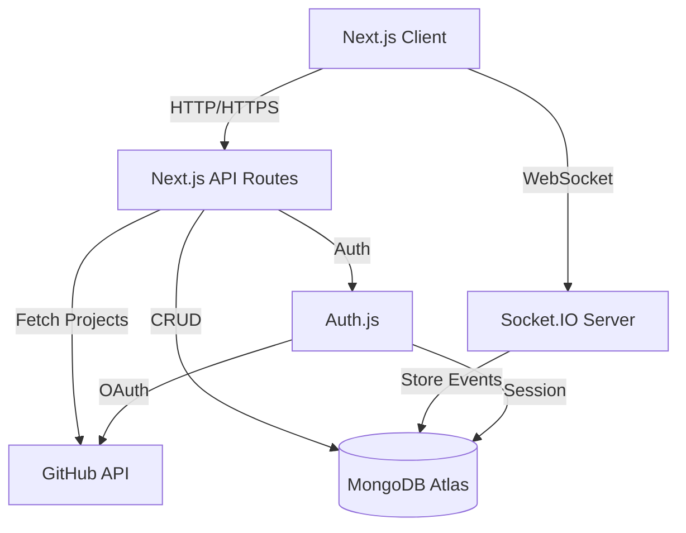

# Design Document

## Overview

The Agile Planning Tools application is a real-time collaborative web application built with Next.js 14+ (App Router), TypeScript, Auth.js v5, and MongoDB Atlas. The system enables distributed teams to conduct planning poker sessions with GitHub integration for story management.

### Technology Stack

- **Frontend**: Next.js 14+ (App Router), React 18+, TypeScript, Tailwind CSS
- **UI Components**: Shadcn UI (Radix UI primitives)
- **Styling**: Tailwind CSS with custom theme, CSS variables for theming
- **Icons**: Lucide React
- **Animations**: Framer Motion for smooth transitions
- **Backend**: Next.js API Routes, Server Actions
- **Authentication**: Auth.js v5 (NextAuth.js) with GitHub Provider
- **Database**: MongoDB Atlas with Mongoose ODM
- **Real-time**: Socket.IO for WebSocket connections
- **GitHub Integration**: Octokit (GitHub REST API v3)
- **Deployment**: Vercel (recommended) or similar platform

## Architecture

### High-Level Architecture



### Application Structure

```
/
├── app/
│   ├── (auth)/
│   │   ├── login/
│   │   └── error/
│   ├── (dashboard)/
│   │   ├── page.tsx                 # Dashboard/Home
│   │   ├── projects/                # Project management (Phase 2)
│   │   │   ├── page.tsx             # Projects list
│   │   │   ├── new/                 # Create project
│   │   │   └── [projectId]/         # Project details
│   │   │       ├── page.tsx         # Project dashboard
│   │   │       ├── settings/        # Project settings
│   │   │       └── members/         # Team management
│   │   ├── sessions/
│   │   │   ├── new/                 # Create session
│   │   │   └── [sessionId]/         # Active session
│   │   ├── history/                 # Session history
│   │   └── notifications/           # Notifications page (Phase 2)
│   ├── api/
│   │   ├── auth/[...nextauth]/      # Auth.js routes
│   │   ├── projects/                # Project CRUD (Phase 2)
│   │   │   ├── route.ts             # List/Create projects
│   │   │   └── [projectId]/
│   │   │       ├── route.ts         # Get/Update/Delete project
│   │   │       ├── members/         # Member management
│   │   │       └── invitations/     # Invitation management
│   │   ├── invitations/             # Invitation actions (Phase 2)
│   │   │   └── [invitationId]/
│   │   │       ├── accept/
│   │   │       └── decline/
│   │   ├── sessions/                # Session CRUD
│   │   │   └── [sessionId]/
│   │   │       ├── messages/        # Chat messages (Phase 2)
│   │   │       ├── stories/
│   │   │       │   └── [storyId]/
│   │   │       │       └── comments/ # Story comments (Phase 2)
│   │   │       ├── revote/          # Re-voting (Phase 2)
│   │   │       └── whiteboard/      # Whiteboard (Phase 2)
│   │   ├── notifications/           # Notifications (Phase 2)
│   │   ├── github/                  # GitHub integration
│   │   └── socket/                  # Socket.IO handler
│   └── layout.tsx
├── components/
│   ├── ui/                          # Shadcn UI components
│   ├── auth/
│   ├── project/                     # Project components (Phase 2)
│   │   ├── project-card.tsx
│   │   ├── project-form.tsx
│   │   ├── project-settings.tsx
│   │   ├── member-list.tsx
│   │   └── invitation-dialog.tsx
│   ├── session/
│   │   ├── chat-panel.tsx           # Session chat (Phase 2)
│   │   ├── story-comments.tsx       # Story comments (Phase 2)
│   │   ├── voting-status.tsx        # Enhanced voting UI (Phase 2)
│   │   ├── vote-history.tsx         # Vote history (Phase 2)
│   │   └── backlog-manager.tsx      # Backlog management (Phase 2)
│   ├── poker/
│   ├── github/
│   ├── whiteboard/                  # Whiteboard components (Phase 2)
│   │   ├── whiteboard-canvas.tsx
│   │   ├── whiteboard-toolbar.tsx
│   │   └── snapshot-gallery.tsx
│   ├── notifications/               # Notification components (Phase 2)
│   │   ├── notification-bell.tsx
│   │   ├── notification-list.tsx
│   │   └── notification-item.tsx
│   └── layout/                      # Responsive layout components
├── lib/
│   ├── auth.ts                      # Auth.js configuration
│   ├── db.ts                        # MongoDB connection
│   ├── socket.ts                    # Socket.IO setup
│   ├── github.ts                    # GitHub API client
│   ├── email.ts                     # Email service (Phase 2)
│   ├── permissions.ts               # Permission utilities (Phase 2)
│   └── utils.ts                     # Shadcn cn() utility
├── models/
│   ├── User.ts
│   ├── Session.ts
│   ├── Estimate.ts
│   ├── Project.ts                   # Phase 2
│   ├── Invitation.ts                # Phase 2
│   ├── ChatMessage.ts               # Phase 2
│   ├── Notification.ts              # Phase 2
│   └── WhiteboardSnapshot.ts        # Phase 2
├── types/
│   └── index.ts
├── hooks/
│   ├── use-mobile.tsx               # Responsive breakpoint hook
│   ├── use-chat.tsx                 # Chat hook (Phase 2)
│   ├── use-notifications.tsx        # Notifications hook (Phase 2)
│   └── use-whiteboard.tsx           # Whiteboard hook (Phase 2)
└── socket-server.ts                 # Custom Socket.IO server
```

## Components and Interfaces

### 1. Authentication System

**Auth.js Configuration** (`lib/auth.ts`)

```typescript
interface AuthConfig {
  providers: [GitHubProvider]
  adapter: MongoDBAdapter
  session: {
    strategy: "jwt"
  }
  callbacks: {
    jwt: (token, user, account) => Promise<JWT>
    session: (session, token) => Promise<Session>
  }
}
```

**User Model** (`models/User.ts`)

```typescript
interface IUser {
  _id: ObjectId
  githubId: string
  username: string
  email: string
  avatarUrl: string
  accessToken?: string  // Encrypted GitHub token for API access
  createdAt: Date
  updatedAt: Date
}
```

### 2. Session Management

**Session Model** (`models/Session.ts`)

```typescript
interface ISession {
  _id: ObjectId
  sessionId: string              // Unique shareable ID
  hostId: ObjectId               // Reference to User
  name: string
  status: 'active' | 'archived'
  participants: IParticipant[]
  currentStory?: IStory
  githubIntegration?: IGitHubIntegration
  createdAt: Date
  updatedAt: Date
}

interface IParticipant {
  userId: ObjectId
  username: string
  avatarUrl: string
  joinedAt: Date
  isOnline: boolean
}

interface IStory {
  id: string
  title: string
  description: string
  source: 'manual' | 'github'
  githubIssueNumber?: number
  githubRepoFullName?: string
}

interface IGitHubIntegration {
  repoOwner: string
  repoName: string
  projectNumber?: number
  connectedAt: Date
}
```

**Estimate Model** (`models/Estimate.ts`)

```typescript
interface IEstimate {
  _id: ObjectId
  sessionId: ObjectId
  storyId: string
  roundNumber: number
  votes: IVote[]
  finalEstimate?: number
  revealedAt?: Date
  finalizedAt?: Date
  createdAt: Date
}

interface IVote {
  userId: ObjectId
  username: string
  value: number
  votedAt: Date
}
```

### 3. Real-time Communication

**Socket.IO Events**

```typescript
// Client -> Server Events
interface ClientToServerEvents {
  'session:join': (sessionId: string) => void
  'session:leave': (sessionId: string) => void
  'vote:cast': (sessionId: string, value: number) => void
  'vote:change': (sessionId: string, value: number) => void
  'story:select': (sessionId: string, story: IStory) => void
  'round:reveal': (sessionId: string) => void
  'estimate:finalize': (sessionId: string, value: number) => void
  'session:end': (sessionId: string) => void
}

// Server -> Client Events
interface ServerToClientEvents {
  'participant:joined': (participant: IParticipant) => void
  'participant:left': (userId: string) => void
  'vote:cast': (userId: string, hasVoted: boolean) => void
  'story:selected': (story: IStory) => void
  'round:revealed': (results: IEstimateResults) => void
  'estimate:finalized': (value: number) => void
  'session:ended': () => void
  'error': (message: string) => void
}

interface IEstimateResults {
  votes: IVote[]
  average: number
  min: number
  max: number
}
```

### 4. GitHub Integration

**GitHub Service** (`lib/github.ts`)

```typescript
interface GitHubService {
  // Authenticate with user's GitHub token
  authenticate(accessToken: string): Octokit
  
  // Fetch user's accessible repositories
  getRepositories(octokit: Octokit): Promise<IRepository[]>
  
  // Fetch issues from a repository
  getIssues(octokit: Octokit, owner: string, repo: string): Promise<IIssue[]>
  
  // Fetch project items (GitHub Projects V2)
  getProjectItems(octokit: Octokit, owner: string, projectNumber: number): Promise<IProjectItem[]>
  
  // Update issue with estimate
  updateIssueEstimate(octokit: Octokit, owner: string, repo: string, issueNumber: number, estimate: number): Promise<void>
  
  // Post comment on issue
  postIssueComment(octokit: Octokit, owner: string, repo: string, issueNumber: number, comment: string): Promise<void>
}

interface IRepository {
  id: number
  fullName: string
  name: string
  owner: string
}

interface IIssue {
  number: number
  title: string
  body: string
  labels: string[]
  state: string
}

interface IProjectItem {
  id: string
  title: string
  body: string
  issueNumber?: number
}
```

### 5. Project Management (Phase 2)

**Project Model** (`models/Project.ts`)

```typescript
interface IProject {
  _id: ObjectId
  projectId: string              // Unique project identifier
  name: string
  description: string
  ownerId: ObjectId              // Reference to User (creator)
  members: IProjectMember[]
  settings: IProjectSettings
  createdAt: Date
  updatedAt: Date
}

interface IProjectMember {
  userId: ObjectId
  username: string
  avatarUrl: string
  role: 'owner' | 'admin' | 'member'
  joinedAt: Date
}

interface IProjectSettings {
  defaultCardValues: 'fibonacci' | 'tshirt' | 'custom'
  customCardValues?: number[]
  defaultVotingMode: 'anonymous' | 'open'
  githubIntegration?: {
    defaultRepo?: string
    defaultProject?: number
  }
}
```

**Invitation Model** (`models/Invitation.ts`)

```typescript
interface IInvitation {
  _id: ObjectId
  projectId: ObjectId            // Reference to Project
  invitedBy: ObjectId            // Reference to User
  invitedUser?: ObjectId         // Reference to User (if registered)
  invitedEmail?: string          // Email if user not registered
  invitedGithubUsername?: string // GitHub username
  role: 'admin' | 'member'
  status: 'pending' | 'accepted' | 'declined' | 'expired'
  token: string                  // Unique invitation token
  expiresAt: Date
  createdAt: Date
  respondedAt?: Date
}
```

### 6. Communication System (Phase 2)

**Chat Message Model** (`models/ChatMessage.ts`)

```typescript
interface IChatMessage {
  _id: ObjectId
  sessionId: ObjectId            // Reference to Session
  userId: ObjectId               // Reference to User
  username: string
  avatarUrl: string
  message: string
  type: 'text' | 'system'        // System messages for events
  createdAt: Date
}
```

**Story Comment Model** (embedded in Story)

```typescript
interface IStoryComment {
  id: string
  userId: ObjectId
  username: string
  avatarUrl: string
  comment: string
  createdAt: Date
  syncedToGitHub: boolean
}

// Updated IStory interface
interface IStory {
  id: string
  title: string
  description: string
  source: 'manual' | 'github'
  githubIssueNumber?: number
  githubRepoFullName?: string
  status: 'ready' | 'not-ready' | 'estimated'
  order: number                  // For backlog ordering
  comments: IStoryComment[]
  labels?: string[]
  assignee?: string
}
```

**Vote Comment** (updated IVote)

```typescript
interface IVote {
  userId: ObjectId
  username: string
  value: number
  comment?: string               // Optional rationale
  votedAt: Date
}
```

### 7. Notification System (Phase 2)

**Notification Model** (`models/Notification.ts`)

```typescript
interface INotification {
  _id: ObjectId
  userId: ObjectId               // Reference to User
  type: 'project_invitation' | 'session_created' | 'session_starting' | 'session_ended' | 'mention'
  title: string
  message: string
  link?: string                  // Deep link to relevant page
  read: boolean
  metadata?: any                 // Type-specific data
  createdAt: Date
  expiresAt: Date                // Auto-delete after 30 days
}
```

**User Notification Preferences** (added to User model)

```typescript
interface IUser {
  _id: ObjectId
  githubId: string
  username: string
  email: string
  avatarUrl: string
  accessToken?: string
  notificationPreferences: INotificationPreferences
  createdAt: Date
  updatedAt: Date
}

interface INotificationPreferences {
  email: {
    sessionInvitations: boolean
    sessionReminders: boolean
    sessionSummaries: boolean
    projectInvitations: boolean
  }
  inApp: {
    sessionInvitations: boolean
    sessionReminders: boolean
    projectInvitations: boolean
    mentions: boolean
  }
}
```

### 8. Whiteboard System (Phase 2)

**Whiteboard Snapshot Model** (`models/WhiteboardSnapshot.ts`)

```typescript
interface IWhiteboardSnapshot {
  _id: ObjectId
  sessionId: ObjectId            // Reference to Session
  storyId?: string               // Optional story attachment
  createdBy: ObjectId            // Reference to User
  data: any                      // Whiteboard library-specific data
  imageUrl?: string              // PNG/SVG export URL
  createdAt: Date
}
```

**External Tool Embed** (added to Session)

```typescript
interface IExternalEmbed {
  type: 'miro' | 'figma' | 'google-docs' | 'google-sheets'
  url: string
  embedUrl: string               // Processed embed URL
  title: string
  addedBy: ObjectId
  addedAt: Date
}

// Updated ISession interface
interface ISession {
  _id: ObjectId
  sessionId: string
  projectId: ObjectId            // Reference to Project (Phase 2)
  hostId: ObjectId
  name: string
  status: 'active' | 'archived'
  votingMode: 'anonymous' | 'open'
  participants: IParticipant[]
  currentStory?: IStory
  stories: IStory[]
  githubIntegration?: IGitHubIntegration
  externalEmbeds: IExternalEmbed[]
  createdAt: Date
  updatedAt: Date
}
```

### 9. Enhanced Socket.IO Events (Phase 2)

```typescript
// Additional Client -> Server Events
interface ClientToServerEvents {
  // ... existing events ...
  
  // Chat events
  'chat:message': (sessionId: string, message: string) => void
  'chat:typing': (sessionId: string, isTyping: boolean) => void
  
  // Story comment events
  'story:comment': (sessionId: string, storyId: string, comment: string) => void
  
  // Voting events
  'vote:cast': (sessionId: string, value: number, comment?: string) => void
  'round:revote': (sessionId: string) => void
  
  // Whiteboard events
  'whiteboard:update': (sessionId: string, data: any) => void
  'whiteboard:snapshot': (sessionId: string) => void
}

// Additional Server -> Client Events
interface ServerToClientEvents {
  // ... existing events ...
  
  // Chat events
  'chat:message': (message: IChatMessage) => void
  'chat:typing': (userId: string, username: string, isTyping: boolean) => void
  
  // Story comment events
  'story:comment': (storyId: string, comment: IStoryComment) => void
  
  // Voting events
  'vote:status': (userId: string, hasVoted: boolean, votingMode: string) => void
  'round:revote': (roundNumber: number) => void
  'vote:reminder': (message: string) => void
  
  // Whiteboard events
  'whiteboard:update': (data: any) => void
  'whiteboard:snapshot': (snapshot: IWhiteboardSnapshot) => void
  
  // Notification events
  'notification:new': (notification: INotification) => void
}
```

## Data Models

### MongoDB Collections

**users**
```typescript
{
  _id: ObjectId
  githubId: string (indexed, unique)
  username: string
  email: string
  avatarUrl: string
  accessToken: string (encrypted)
  createdAt: Date
  updatedAt: Date
}
```

**sessions**
```typescript
{
  _id: ObjectId
  sessionId: string (indexed, unique)
  hostId: ObjectId (ref: users)
  name: string
  status: string (enum: active, archived)
  participants: [{
    userId: ObjectId (ref: users)
    username: string
    avatarUrl: string
    joinedAt: Date
    isOnline: boolean
  }]
  currentStory: {
    id: string
    title: string
    description: string
    source: string
    githubIssueNumber: number
    githubRepoFullName: string
  }
  githubIntegration: {
    repoOwner: string
    repoName: string
    projectNumber: number
    connectedAt: Date
  }
  createdAt: Date
  updatedAt: Date
}
```

**estimates**
```typescript
{
  _id: ObjectId
  sessionId: ObjectId (ref: sessions, indexed)
  storyId: string
  roundNumber: number
  votes: [{
    userId: ObjectId (ref: users)
    username: string
    value: number
    votedAt: Date
  }]
  finalEstimate: number
  revealedAt: Date
  finalizedAt: Date
  createdAt: Date
}
```

**projects** (Phase 2)
```typescript
{
  _id: ObjectId
  projectId: string (indexed, unique)
  name: string
  description: string
  ownerId: ObjectId (ref: users, indexed)
  members: [{
    userId: ObjectId (ref: users)
    username: string
    avatarUrl: string
    role: string (enum: owner, admin, member)
    joinedAt: Date
  }]
  settings: {
    defaultCardValues: string
    customCardValues: number[]
    defaultVotingMode: string
    githubIntegration: {
      defaultRepo: string
      defaultProject: number
    }
  }
  createdAt: Date
  updatedAt: Date
}
```

**invitations** (Phase 2)
```typescript
{
  _id: ObjectId
  projectId: ObjectId (ref: projects, indexed)
  invitedBy: ObjectId (ref: users)
  invitedUser: ObjectId (ref: users)
  invitedEmail: string
  invitedGithubUsername: string
  role: string (enum: admin, member)
  status: string (enum: pending, accepted, declined, expired)
  token: string (indexed, unique)
  expiresAt: Date (indexed)
  createdAt: Date
  respondedAt: Date
}
```

**chatMessages** (Phase 2)
```typescript
{
  _id: ObjectId
  sessionId: ObjectId (ref: sessions, indexed)
  userId: ObjectId (ref: users)
  username: string
  avatarUrl: string
  message: string
  type: string (enum: text, system)
  createdAt: Date (indexed)
}
```

**notifications** (Phase 2)
```typescript
{
  _id: ObjectId
  userId: ObjectId (ref: users, indexed)
  type: string (enum: project_invitation, session_created, session_starting, session_ended, mention)
  title: string
  message: string
  link: string
  read: boolean (indexed)
  metadata: object
  createdAt: Date (indexed)
  expiresAt: Date (indexed)
}
```

**whiteboardSnapshots** (Phase 2)
```typescript
{
  _id: ObjectId
  sessionId: ObjectId (ref: sessions, indexed)
  storyId: string
  createdBy: ObjectId (ref: users)
  data: object
  imageUrl: string
  createdAt: Date
}
```

### Indexes

**Phase 1 Indexes:**
- `users.githubId`: Unique index for GitHub authentication
- `sessions.sessionId`: Unique index for session lookup
- `sessions.hostId`: Index for host queries
- `estimates.sessionId`: Index for session estimate queries
- `estimates.sessionId + roundNumber`: Compound index for round queries

**Phase 2 Indexes:**
- `projects.projectId`: Unique index for project lookup
- `projects.ownerId`: Index for owner queries
- `projects.members.userId`: Index for member queries
- `invitations.projectId`: Index for project invitation queries
- `invitations.token`: Unique index for invitation token lookup
- `invitations.expiresAt`: Index for expiration cleanup
- `chatMessages.sessionId`: Index for session chat queries
- `chatMessages.createdAt`: Index for chronological ordering
- `notifications.userId`: Index for user notification queries
- `notifications.read`: Index for unread notification queries
- `notifications.expiresAt`: Index for expiration cleanup
- `whiteboardSnapshots.sessionId`: Index for session snapshot queries
- `sessions.projectId`: Index for project session queries

## API Routes

### Phase 1 API Routes

**Authentication**
- `POST /api/auth/signin` - GitHub OAuth sign in
- `POST /api/auth/signout` - Sign out
- `GET /api/auth/session` - Get current session

**Sessions**
- `POST /api/sessions` - Create new session
- `GET /api/sessions` - List user's sessions
- `GET /api/sessions/[sessionId]` - Get session details
- `POST /api/sessions/[sessionId]/join` - Join session
- `POST /api/sessions/[sessionId]/leave` - Leave session
- `POST /api/sessions/[sessionId]/story` - Select story
- `POST /api/sessions/[sessionId]/vote` - Cast vote
- `GET /api/sessions/[sessionId]/votes` - Get current votes
- `POST /api/sessions/[sessionId]/reveal` - Reveal estimates
- `POST /api/sessions/[sessionId]/finalize` - Finalize estimate
- `POST /api/sessions/[sessionId]/end` - End session
- `GET /api/sessions/history` - Get session history
- `GET /api/sessions/[sessionId]/history` - Get detailed session history
- `GET /api/sessions/[sessionId]/export` - Export session data

**GitHub Integration**
- `GET /api/github/repositories` - List user's repositories
- `GET /api/github/issues` - List repository issues
- `GET /api/github/projects` - List GitHub projects
- `POST /api/sessions/[sessionId]/github/import` - Import stories from GitHub

### Phase 2 API Routes

**Projects**
- `POST /api/projects` - Create new project
- `GET /api/projects` - List user's projects
- `GET /api/projects/[projectId]` - Get project details
- `PATCH /api/projects/[projectId]` - Update project settings
- `DELETE /api/projects/[projectId]` - Delete project (owner only)

**Project Members**
- `GET /api/projects/[projectId]/members` - List project members
- `POST /api/projects/[projectId]/members` - Add member (owner/admin)
- `PATCH /api/projects/[projectId]/members/[userId]` - Update member role
- `DELETE /api/projects/[projectId]/members/[userId]` - Remove member

**Invitations**
- `POST /api/projects/[projectId]/invitations` - Send invitation
- `GET /api/projects/[projectId]/invitations` - List pending invitations
- `DELETE /api/projects/[projectId]/invitations/[invitationId]` - Cancel invitation
- `POST /api/invitations/[invitationId]/accept` - Accept invitation
- `POST /api/invitations/[invitationId]/decline` - Decline invitation
- `GET /api/invitations/me` - Get user's pending invitations

**Session Chat**
- `POST /api/sessions/[sessionId]/messages` - Send chat message
- `GET /api/sessions/[sessionId]/messages` - Get chat history

**Story Comments**
- `POST /api/sessions/[sessionId]/stories/[storyId]/comments` - Add comment
- `GET /api/sessions/[sessionId]/stories/[storyId]/comments` - Get comments

**Voting Enhancements**
- `POST /api/sessions/[sessionId]/revote` - Start re-vote
- `GET /api/sessions/[sessionId]/vote-history` - Get vote history

**Backlog Management**
- `PATCH /api/sessions/[sessionId]/stories/order` - Reorder stories
- `PATCH /api/sessions/[sessionId]/stories/[storyId]/status` - Update story status
- `POST /api/sessions/[sessionId]/stories/bulk` - Bulk operations

**Notifications**
- `GET /api/notifications` - Get user notifications
- `PATCH /api/notifications/[notificationId]/read` - Mark as read
- `DELETE /api/notifications/[notificationId]` - Dismiss notification
- `PATCH /api/notifications/read-all` - Mark all as read
- `GET /api/notifications/preferences` - Get notification preferences
- `PATCH /api/notifications/preferences` - Update preferences

**Whiteboard**
- `POST /api/sessions/[sessionId]/whiteboard/snapshot` - Save snapshot
- `GET /api/sessions/[sessionId]/whiteboard/snapshots` - List snapshots
- `POST /api/sessions/[sessionId]/whiteboard/attach` - Attach to story

**External Embeds**
- `POST /api/sessions/[sessionId]/embeds` - Add external embed
- `GET /api/sessions/[sessionId]/embeds` - List embeds
- `DELETE /api/sessions/[sessionId]/embeds/[embedId]` - Remove embed

### API Response Format

**Success Response**
```typescript
{
  success: true
  data: any
  message?: string
}
```

**Error Response**
```typescript
{
  success: false
  error: {
    code: string
    message: string
    details?: any
  }
}
```

**Paginated Response**
```typescript
{
  success: true
  data: any[]
  pagination: {
    total: number
    limit: number
    offset: number
    hasMore: boolean
  }
}
```

## Error Handling

### Error Types

```typescript
enum ErrorCode {
  // Authentication Errors
  AUTH_FAILED = 'AUTH_FAILED',
  UNAUTHORIZED = 'UNAUTHORIZED',
  
  // Session Errors
  SESSION_NOT_FOUND = 'SESSION_NOT_FOUND',
  SESSION_ENDED = 'SESSION_ENDED',
  NOT_SESSION_HOST = 'NOT_SESSION_HOST',
  
  // Project Errors (Phase 2)
  PROJECT_NOT_FOUND = 'PROJECT_NOT_FOUND',
  NOT_PROJECT_OWNER = 'NOT_PROJECT_OWNER',
  NOT_PROJECT_ADMIN = 'NOT_PROJECT_ADMIN',
  NOT_PROJECT_MEMBER = 'NOT_PROJECT_MEMBER',
  INSUFFICIENT_PERMISSIONS = 'INSUFFICIENT_PERMISSIONS',
  
  // Invitation Errors (Phase 2)
  INVITATION_NOT_FOUND = 'INVITATION_NOT_FOUND',
  INVITATION_EXPIRED = 'INVITATION_EXPIRED',
  INVITATION_ALREADY_RESPONDED = 'INVITATION_ALREADY_RESPONDED',
  USER_ALREADY_MEMBER = 'USER_ALREADY_MEMBER',
  
  // GitHub Errors
  GITHUB_API_ERROR = 'GITHUB_API_ERROR',
  GITHUB_TOKEN_INVALID = 'GITHUB_TOKEN_INVALID',
  
  // Voting Errors
  ROUND_NOT_ACTIVE = 'ROUND_NOT_ACTIVE',
  ALREADY_REVEALED = 'ALREADY_REVEALED',
  INVALID_CARD_VALUE = 'INVALID_CARD_VALUE',
  MAX_REVOTES_REACHED = 'MAX_REVOTES_REACHED',
  
  // Chat Errors (Phase 2)
  MESSAGE_TOO_LONG = 'MESSAGE_TOO_LONG',
  CHAT_DISABLED = 'CHAT_DISABLED',
  
  // Notification Errors (Phase 2)
  NOTIFICATION_NOT_FOUND = 'NOTIFICATION_NOT_FOUND',
  
  // Database Errors
  DB_CONNECTION_ERROR = 'DB_CONNECTION_ERROR',
  DB_OPERATION_FAILED = 'DB_OPERATION_FAILED',
  
  // Validation Errors
  INVALID_INPUT = 'INVALID_INPUT',
  MISSING_REQUIRED_FIELD = 'MISSING_REQUIRED_FIELD'
}

interface AppError {
  code: ErrorCode
  message: string
  statusCode: number
  details?: any
}
```

### Error Handling Strategy

1. **API Routes**: Return standardized error responses with appropriate HTTP status codes
2. **Server Actions**: Throw typed errors that are caught by error boundaries
3. **Socket.IO**: Emit error events to specific clients with error details
4. **Client**: Display user-friendly error messages with retry options
5. **Logging**: Log all errors to console (development) and monitoring service (production)

### Error Recovery

- **Authentication Failures**: Redirect to login page with error message
- **Session Not Found**: Redirect to dashboard with notification
- **GitHub API Errors**: Display error and allow retry or manual story entry
- **WebSocket Disconnection**: Attempt automatic reconnection with exponential backoff
- **Database Errors**: Display generic error and log details for debugging

## Testing Strategy

### Unit Tests

- **Models**: Mongoose schema validation and methods
- **Utilities**: GitHub API client, encryption helpers
- **Business Logic**: Vote calculation, estimate averaging

### Integration Tests

- **API Routes**: Session CRUD operations, GitHub integration endpoints
- **Authentication**: GitHub OAuth flow, session management
- **Database Operations**: CRUD operations with test database

### End-to-End Tests

- **User Flows**: 
  - Complete estimation session from creation to finalization
  - GitHub integration and story import
  - Multi-user real-time collaboration
- **Tools**: Playwright or Cypress for browser automation

### Real-time Testing

- **Socket.IO Events**: Test event emission and reception
- **Concurrent Users**: Simulate multiple participants in a session
- **Connection Handling**: Test reconnection and error scenarios

### Testing Environment

- **Test Database**: Separate MongoDB Atlas cluster or local MongoDB instance
- **Mock GitHub API**: Use Octokit mocks for GitHub integration tests
- **Test Users**: Seed test database with mock users and sessions

## Security Considerations

### Authentication & Authorization

- GitHub OAuth tokens stored encrypted in database
- JWT sessions with secure httpOnly cookies
- Session validation on every API request and Socket.IO connection
- Host-only actions verified server-side

### Data Protection

- Environment variables for sensitive credentials
- MongoDB connection string with authentication
- Rate limiting on API routes
- Input validation and sanitization

### Real-time Security

- Socket.IO authentication middleware
- Session-based room access control
- Validate user permissions before broadcasting events

## UI/UX Design

### Design System - Shadcn UI

The application uses Shadcn UI, a collection of re-usable components built with Radix UI and Tailwind CSS. This provides:

- **Accessible Components**: ARIA-compliant, keyboard navigable
- **Customizable**: Full control over component styling
- **Dark Mode**: Built-in dark mode support with next-themes
- **Type-safe**: Full TypeScript support

### Theme Configuration

**Color Palette** (Modern, Developer-Focused)

```css
:root {
  /* Primary - Vibrant Blue/Purple gradient theme */
  --primary: 262 83% 58%;
  --primary-foreground: 0 0% 100%;
  
  /* Accent - Complementary colors */
  --accent: 280 65% 60%;
  --accent-foreground: 0 0% 100%;
  
  /* Background - Clean, modern */
  --background: 0 0% 100%;
  --foreground: 222 47% 11%;
  
  /* Card/Surface */
  --card: 0 0% 100%;
  --card-foreground: 222 47% 11%;
  
  /* Muted - Subtle backgrounds */
  --muted: 210 40% 96%;
  --muted-foreground: 215 16% 47%;
  
  /* Border */
  --border: 214 32% 91%;
  --input: 214 32% 91%;
  --ring: 262 83% 58%;
  
  /* Destructive */
  --destructive: 0 84% 60%;
  --destructive-foreground: 0 0% 100%;
}

.dark {
  --background: 222 47% 11%;
  --foreground: 210 40% 98%;
  
  --card: 222 47% 11%;
  --card-foreground: 210 40% 98%;
  
  --muted: 217 33% 17%;
  --muted-foreground: 215 20% 65%;
  
  --border: 217 33% 17%;
  --input: 217 33% 17%;
  
  /* Keep primary vibrant in dark mode */
  --primary: 262 83% 58%;
  --accent: 280 65% 60%;
}
```

### Responsive Design Strategy

**Breakpoints** (Tailwind CSS defaults)

- **Mobile**: < 640px (sm)
- **Tablet**: 640px - 1024px (sm to lg)
- **Desktop**: > 1024px (lg+)

**Layout Adaptations**

1. **Mobile (< 640px)**
   - Single column layout
   - Bottom sheet for card selection
   - Hamburger menu for navigation
   - Stacked participant avatars
   - Full-width cards and buttons
   - Collapsible story details

2. **Tablet (640px - 1024px)**
   - Two-column layout where appropriate
   - Side drawer for participants
   - Grid layout for poker cards (2-3 columns)
   - Floating action buttons
   - Modal dialogs for GitHub integration

3. **Desktop (> 1024px)**
   - Three-column layout (participants | main | details)
   - Persistent sidebar navigation
   - Grid layout for poker cards (4-5 columns)
   - Inline forms and actions
   - Split-screen for session management

### Key UI Components

**Shadcn Components to Use**

- `Button`: Primary actions, card selection
- `Card`: Session cards, story cards, result displays
- `Dialog`: Modals for session creation, GitHub integration
- `Sheet`: Mobile navigation, participant list
- `Avatar`: User profiles, participant indicators
- `Badge`: Status indicators, vote counts
- `Tabs`: Navigation between session views
- `Select`: Dropdown for GitHub repo/project selection
- `Input`: Form fields for session creation
- `Separator`: Visual dividers
- `Skeleton`: Loading states
- `Toast`: Notifications and feedback
- `Tooltip`: Contextual help
- `ScrollArea`: Scrollable lists
- `DropdownMenu`: User menu, actions

### Animation & Interactions

**Framer Motion Animations**

- **Card Flip**: Reveal animation when estimates are shown
- **Slide In**: Participant join/leave animations
- **Pulse**: Voting indicator animations
- **Scale**: Button press feedback
- **Fade**: Page transitions
- **Stagger**: Sequential card reveals

**Micro-interactions**

- Hover effects on cards and buttons
- Loading spinners for async operations
- Progress indicators for multi-step flows
- Confetti effect on estimate finalization
- Smooth transitions between states

### Page Layouts

**Login Page**
- Centered card with GitHub login button
- Animated background gradient
- Responsive: Full-screen on mobile, centered card on desktop

**Dashboard**
- Header with user profile and theme toggle
- Grid of active sessions
- "Create Session" prominent CTA
- Responsive: Single column on mobile, 2-3 columns on desktop

**Session Page**
- Header: Session name, participants, actions
- Main area: Current story, poker cards
- Sidebar: Participant list, voting status
- Results panel: Revealed estimates, statistics
- Responsive: Stacked on mobile, multi-column on desktop

**Mobile-Specific Considerations**

- Touch-friendly tap targets (min 44x44px)
- Swipe gestures for navigation
- Bottom navigation bar
- Pull-to-refresh for session updates
- Optimized for one-handed use

## Performance Considerations

### Optimization Strategies

- **Database**: Connection pooling, indexed queries
- **Real-time**: Room-based broadcasting to reduce message overhead
- **Caching**: Session data cached in memory for active sessions
- **API**: Pagination for GitHub issue lists
- **Frontend**: React Server Components for initial page load, client components for interactivity

### Scalability

- Stateless API design for horizontal scaling
- Socket.IO with Redis adapter for multi-instance deployments (future enhancement)
- MongoDB Atlas auto-scaling for database load
- CDN for static assets

## Deployment

### Environment Variables

```
# Database
MONGODB_URI=mongodb+srv://...

# Auth.js
NEXTAUTH_URL=https://yourdomain.com
NEXTAUTH_SECRET=your-secret-key

# GitHub OAuth
GITHUB_CLIENT_ID=your-client-id
GITHUB_CLIENT_SECRET=your-client-secret

# Encryption
ENCRYPTION_KEY=your-encryption-key

# Email Service (Phase 2)
EMAIL_SERVICE=sendgrid  # or 'ses' or 'resend'
EMAIL_API_KEY=your-email-api-key
EMAIL_FROM=noreply@yourdomain.com
EMAIL_FROM_NAME=Agile Planning Tool

# Application
APP_URL=https://yourdomain.com
APP_NAME=Agile Planning Tool

# Feature Flags (Phase 2)
ENABLE_WHITEBOARD=true
ENABLE_EXTERNAL_EMBEDS=true
ENABLE_EMAIL_NOTIFICATIONS=true
```

### Deployment Steps

1. Set up MongoDB Atlas cluster
2. Configure GitHub OAuth App
3. Deploy to Vercel (or similar platform)
4. Configure environment variables
5. Run database migrations/seed if needed
6. Test authentication and session creation

### Monitoring

- Application logs for errors and performance
- Database query performance monitoring
- WebSocket connection metrics
- GitHub API rate limit tracking
